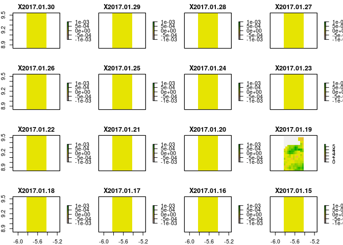
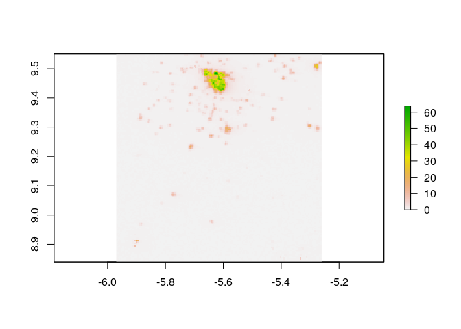

<!-- README.md is generated from README.Rmd. Please edit that file -->

# getremotedata

<!-- badges: start -->

[](https://cran.r-project.org/package=getRemoteData)
[](https://github.com/ptaconet/getRemoteData)
<!-- badges: end -->

**getremotedata** is an R package that provides functions to
**harmonize** the **download** of various open data collections
available on the web.

## Collections available in getremotedata

Currently **getremotedata** supports download of 5 data collections.
Details of each product available for download are provided in the table
above or through the function `grd_list_collections()`. Want more
details on a specific collection ? Click on the “DOI” column \!

<details>

<summary><b>Data collections available for download with getremotedata
(click to expand)</b></summary>

<p>

<table class="table" style="margin-left: auto; margin-right: auto;">

<thead>

<tr>

<th style="text-align:left;">

Collection

</th>

<th style="text-align:left;">

Name

</th>

<th style="text-align:left;">

Source

</th>

<th style="text-align:left;">

Nature

</th>

<th style="text-align:left;">

DOI

</th>

<th style="text-align:left;">

url\_data\_server

</th>

<th style="text-align:left;">

param\_variables

</th>

<th style="text-align:left;">

param\_roi

</th>

<th style="text-align:left;">

param\_time\_range

</th>

</tr>

</thead>

<tbody>

<tr>

<td style="text-align:left;">

ERA5

</td>

<td style="text-align:left;">

ERA5 hourly data on single levels from 1979 to
present

</td>

<td style="text-align:left;">

ERA5

</td>

<td style="text-align:left;">

Wind

</td>

<td style="text-align:left;">

<https://doi.org/10.24381/cds.adbb2d47>

</td>

<td style="text-align:left;">

<https://dominicroye.github.io/en/2018/access-to-climate-reanalysis-data-from-r/>

</td>

<td style="text-align:left;">

TRUE

</td>

<td style="text-align:left;">

TRUE

</td>

<td style="text-align:left;">

TRUE

</td>

</tr>

<tr>

<td style="text-align:left;">

MIRIADE

</td>

<td style="text-align:left;">

The Virtual Observatory Solar System Object Ephemeris Generator

</td>

<td style="text-align:left;">

IMCCE

</td>

<td style="text-align:left;">

Apparent magnitude of the Moon

</td>

<td style="text-align:left;">

</td>

<td style="text-align:left;">

<http://vo.imcce.fr/webservices/miriade/?ephemcc>

</td>

<td style="text-align:left;">

FALSE

</td>

<td style="text-align:left;">

TRUE

</td>

<td style="text-align:left;">

TRUE

</td>

</tr>

<tr>

<td style="text-align:left;">

SRTMGL1.003

</td>

<td style="text-align:left;">

Digital Elevation Model from the NASA Shuttle Radar Topography Mission
Global 1 arc second

</td>

<td style="text-align:left;">

SRTM

</td>

<td style="text-align:left;">

Elevation

</td>

<td style="text-align:left;">

<https://dx.doi.org/10.5067/MEASURES/SRTM/SRTMGL1.003>

</td>

<td style="text-align:left;">

<https://opendap.cr.usgs.gov/opendap/hyrax/SRTMGL1.003/contents.html>

</td>

<td style="text-align:left;">

FALSE

</td>

<td style="text-align:left;">

TRUE

</td>

<td style="text-align:left;">

FALSE

</td>

</tr>

<tr>

<td style="text-align:left;">

TAMSAT

</td>

<td style="text-align:left;">

Tropical Applications of Meteorology using SATellite data and
ground-based observations

</td>

<td style="text-align:left;">

TAMSAT

</td>

<td style="text-align:left;">

Rainfall

</td>

<td style="text-align:left;">

<http://doi.org/10.1038/sdata.2017.63>

</td>

<td style="text-align:left;">

<https://www.tamsat.org.uk/data/archive>

</td>

<td style="text-align:left;">

TRUE

</td>

<td style="text-align:left;">

FALSE

</td>

<td style="text-align:left;">

TRUE

</td>

</tr>

<tr>

<td style="text-align:left;">

VIIRS\_DNB\_MONTH

</td>

<td style="text-align:left;">

Visible Infrared Imaging Radiometer Suite (VIIRS) Day/Night Band (DNB)

</td>

<td style="text-align:left;">

VIIRS

</td>

<td style="text-align:left;">

Nighttime
lights

</td>

<td style="text-align:left;">

<https://doi.org/10.5067/VIIRS/VNP46A1.001>

</td>

<td style="text-align:left;">

<https://gis.ngdc.noaa.gov/arcgis/rest/services/NPP_VIIRS_DNB/Monthly_AvgRadiance/ImageServer/>

</td>

<td style="text-align:left;">

TRUE

</td>

<td style="text-align:left;">

TRUE

</td>

<td style="text-align:left;">

TRUE

</td>

</tr>

</tbody>

</table>

</p>

</details>

## Get Started

Downloading the data with **getremotedata** is a simple two-steps
workflow :

  - With the function **`grd_get_url()`**, get the URL(s) of the data
    for :
    
      - a collection : see [previous
        section](#collections-available-in-getremotedata),
      - (eventually) variables,
      - (eventually) a region of interest,
      - (eventually) a time range.

  - With any data download function (e.g. `httr::GET()` or
    `opendapr::odr_download_data()`), download the data.

Additional functions include : list collection available for download (
`gdr_list_collections()` ), list variables available for each collection
that has variables ( `gdr_list_variables()` )

## Example

A full data download, import and plot in 4 steps : get the URL,
download, import, plot

**1. Get the URLs of various data collections for a given ROI and time
frame**

``` r
require(sf)
require(getremotedata)
require(dplyr)

roi = st_as_sf(data.frame(geom = "POLYGON ((-5.82 9.54, -5.42 9.55, -5.41 8.84, -5.81 8.84, -5.82 9.54))"), wkt = "geom", crs = 4326)
time_range = as.Date(c("2017-01-01","2017-01-30"))

# SRTM
strm_urls <- grd_get_url(collection = "SRTMGL1.003", roi = roi)
print(str(strm_urls))
#> 'data.frame':    2 obs. of  4 variables:
#>  $ time_start: logi  NA NA
#>  $ name      : chr  "N08W006.SRTMGL1.hgt.zip" "N09W006.SRTMGL1.hgt.zip"
#>  $ url       : chr  "http://e4ftl01.cr.usgs.gov/MEASURES/SRTMGL1.003/2000.02.11/N08W006.SRTMGL1.hgt.zip" "http://e4ftl01.cr.usgs.gov/MEASURES/SRTMGL1.003/2000.02.11/N09W006.SRTMGL1.hgt.zip"
#>  $ destfile  : chr  "SRTMGL1.003/N08W006.SRTMGL1.hgt.zip" "SRTMGL1.003/N09W006.SRTMGL1.hgt.zip"
#> NULL

# TAMSAT
tamsat_urls <- grd_get_url(collection = "TAMSAT",variables = c("daily_rainfall_estimate"), time_range = time_range)
print(str(tamsat_urls))
#> 'data.frame':    30 obs. of  4 variables:
#>  $ time_start: Date, format: "2017-01-30" "2017-01-29" ...
#>  $ name      : chr  "rfe2017_01_30.v3.nc" "rfe2017_01_29.v3.nc" "rfe2017_01_28.v3.nc" "rfe2017_01_27.v3.nc" ...
#>  $ url       : chr  "https://www.tamsat.org.uk/public_data/TAMSAT3/2017/01/rfe2017_01_30.v3.nc" "https://www.tamsat.org.uk/public_data/TAMSAT3/2017/01/rfe2017_01_29.v3.nc" "https://www.tamsat.org.uk/public_data/TAMSAT3/2017/01/rfe2017_01_28.v3.nc" "https://www.tamsat.org.uk/public_data/TAMSAT3/2017/01/rfe2017_01_27.v3.nc" ...
#>  $ destfile  : chr  "TAMSAT/rfe2017_01_30.v3.nc" "TAMSAT/rfe2017_01_29.v3.nc" "TAMSAT/rfe2017_01_28.v3.nc" "TAMSAT/rfe2017_01_27.v3.nc" ...
#> NULL

# VIIRS_DNB_MONTH
viirsdnb_urls <- grd_get_url(collection = "VIIRS_DNB_MONTH",variables = c("Monthly_AvgRadiance"), roi = roi, time_range = time_range)
print(str(viirsdnb_urls))
#> 'data.frame':    1 obs. of  4 variables:
#>  $ time_start: chr "2017-01-01"
#>  $ name      : chr "Monthly_AvgRadiance_201701.tif"
#>  $ url       : chr "https://gis.ngdc.noaa.gov/arcgis/rest/services/NPP_VIIRS_DNB/Monthly_AvgRadiance/ImageServer/exportImage?bbox=-"| __truncated__
#>  $ destfile  : chr "VIIRS_DNB_MONTH/Monthly_AvgRadiance_201701.tif"
#> NULL

# MIRIADE
imcce_urls <- grd_get_url(collection = "MIRIADE", roi = roi, time_range = time_range)
print(str(imcce_urls))
#> 'data.frame':    30 obs. of  4 variables:
#>  $ time_start: Date, format: "2017-01-30" "2017-01-29" ...
#>  $ name      : chr  "20170130.csv" "20170129.csv" "20170128.csv" "20170127.csv" ...
#>  $ url       : chr  "http://vo.imcce.fr/webservices/miriade/ephemcc_query.php?-name=s:Moon&-type=Satellite&-ep=2017-01-30T23:30:00&-"| __truncated__ "http://vo.imcce.fr/webservices/miriade/ephemcc_query.php?-name=s:Moon&-type=Satellite&-ep=2017-01-29T23:30:00&-"| __truncated__ "http://vo.imcce.fr/webservices/miriade/ephemcc_query.php?-name=s:Moon&-type=Satellite&-ep=2017-01-28T23:30:00&-"| __truncated__ "http://vo.imcce.fr/webservices/miriade/ephemcc_query.php?-name=s:Moon&-type=Satellite&-ep=2017-01-27T23:30:00&-"| __truncated__ ...
#>  $ destfile  : chr  "MIRIADE/20170130.csv" "MIRIADE/20170129.csv" "MIRIADE/20170128.csv" "MIRIADE/20170127.csv" ...
#> NULL

# ERA5
era5_urls <- grd_get_url(collection = "ERA5", variables = c("10m_u_component_of_wind","10m_v_component_of_wind"), roi = roi, time_range = as.Date(c("2017-01-01","2017-01-02"))) # ERA5 is an hourly database, so we keep only 1 day (and not a whole month...)
```

**2. Download the data**

``` r
require(httr)
require(purrr)

# Create directories if they do not exist
unique(dirname(data_to_dl$destfile)) %>% lapply(dir.create,recursive = TRUE)

# SRTM
# Login to Earthdata servers is needed to download STRM data. To create an account go to : https://urs.earthdata.nasa.gov/.
# Here we have stored our credentials in local environment variables
username <- Sys.getenv("earthdata_un")
password <- Sys.getenv("earthdata_pw")
srtm_dl <- map2(strm_urls$url,strm_urls$destfile,~GET(url = .x, write_disk(.y), progress() , authenticate(username,password))

# TAMSAT
tamsat_dl <- map2(tamsat_urls$url,tamsat_urls$destfile,~GET(url = .x, write_disk(.y), progress()))

# VIIRS_DNB_MONTH
viirsdnb_dl <- map2(viirsdnb_urls$url,viirsdnb_urls$destfile,~GET(url = .x, write_disk(.y), progress()))

# MIRIADE
imcce_dl <- map2(imcce_urls$url,imcce_urls$destfile,~GET(url = .x, write_disk(.y), progress()))

# ERA5
# For ERA5 we must use a specific function to download the data
era5_dl <- grd_download_data_era5(era5_urls)
```

**3. Import the data in R**

``` r
require(raster)

# SRTM 
rast_srtm <- strm_urls$destfile %>%
  map(~unzip(., exdir = dirname(.))) %>%
  map(~raster(.)) %>%
  do.call(merge,.) %>%
  crop(roi)

# TAMSAT
rast_tamsat <- tamsat_urls$destfile %>%
  map(~raster(.)) %>%
  map(~crop(.,roi)) %>%
  brick()
names(rast_tamsat) <- tamsat_urls$time_start

# VIIRS_DNB_MONTH
rasts_viirs <- viirsdnb_urls$destfile %>%
  map(~raster(.)) %>%
  brick(.)
names(rasts_viirs) <- viirsdnb_urls$time_start

# MIRIADE
miriade_dfs <- imcce_urls$destfile %>%
  map(~read.csv(.,skip=10))

# ERA5
rasts_era5 <- era5_urls$destfile %>%
  map(~raster(., varname = "u10")) %>%
  brick(.)
names(rasts_era5) <- era5_urls$time_start


rast_srtm
#> class       : RasterLayer 
#> dimensions  : 2556, 1475, 3770100  (nrow, ncol, ncell)
#> resolution  : 0.0002777778, 0.0002777778  (x, y)
#> extent      : -5.819861, -5.410139, 8.839861, 9.549861  (xmin, xmax, ymin, ymax)
#> coord. ref. : +proj=longlat +datum=WGS84 +no_defs +ellps=WGS84 +towgs84=0,0,0 
#> data source : in memory
#> names       : layer 
#> values      : 268, 575  (min, max)
rast_tamsat
#> class       : RasterBrick 
#> dimensions  : 19, 11, 209, 30  (nrow, ncol, ncell, nlayers)
#> resolution  : 0.0375, 0.0375  (x, y)
#> extent      : -5.83125, -5.41875, 8.83125, 9.54375  (xmin, xmax, ymin, ymax)
#> coord. ref. : +proj=longlat +datum=WGS84 +ellps=WGS84 +towgs84=0,0,0 
#> data source : in memory
#> names       : X2017.01.30, X2017.01.29, X2017.01.28, X2017.01.27, X2017.01.26, X2017.01.25, X2017.01.24, X2017.01.23, X2017.01.22, X2017.01.21, X2017.01.20, X2017.01.19, X2017.01.18, X2017.01.17, X2017.01.16, ... 
#> min values  :           0,           0,           0,           0,           0,           0,           0,           0,           0,           0,           0,           0,           0,           0,           0, ... 
#> max values  :         0.0,         0.0,         0.0,         0.0,         0.0,         0.0,         0.0,         0.0,         0.0,         0.0,         0.0,         5.8,         0.0,         0.0,         0.0, ...
rasts_viirs
#> class       : RasterBrick 
#> dimensions  : 400, 400, 160000, 1  (nrow, ncol, ncell, nlayers)
#> resolution  : 0.001775, 0.001775  (x, y)
#> extent      : -5.97, -5.26, 8.84, 9.55  (xmin, xmax, ymin, ymax)
#> coord. ref. : +proj=longlat +datum=WGS84 +no_defs +ellps=WGS84 +towgs84=0,0,0 
#> data source : in memory
#> names       : X2017.01.01 
#> min values  :       -0.08 
#> max values  :       63.86
print(str(miriade_dfs[1:3]))
#> List of 3
#>  $ :'data.frame':    1 obs. of  10 variables:
#>   ..$ X..Date.UTC..JD.      : num 2457784
#>   ..$ RA..h.m.s.            : Factor w/ 1 level "23 12 23.31871": 1
#>   ..$ DE..deg.arcmin.arcs   : Factor w/ 1 level "-06 18 29.6643": 1
#>   ..$ Distance..au.         : num 0.00257
#>   ..$ V.Mag                 : num -6.84
#>   ..$ Phase..o.             : num 144
#>   ..$ Sun.elong..o.         : num 35.6
#>   ..$ muRAcosDE..arcsec.min.: num 43.1
#>   ..$ muDE..arcsec.min.     : num 11.2
#>   ..$ Dist_dot..km.s.       : num 0.248
#>  $ :'data.frame':    1 obs. of  10 variables:
#>   ..$ X..Date.UTC..JD.      : num 2457783
#>   ..$ RA..h.m.s.            : Factor w/ 1 level "22 21  8.46964": 1
#>   ..$ DE..deg.arcmin.arcs   : Factor w/ 1 level "-10 10  5.8931": 1
#>   ..$ Distance..au.         : num 0.0026
#>   ..$ V.Mag                 : num -5.26
#>   ..$ Phase..o.             : num 157
#>   ..$ Sun.elong..o.         : num 23.4
#>   ..$ muRAcosDE..arcsec.min.: num 44.5
#>   ..$ muDE..arcsec.min.     : num 10.2
#>   ..$ Dist_dot..km.s.       : num 0.167
#>  $ :'data.frame':    1 obs. of  10 variables:
#>   ..$ X..Date.UTC..JD.      : num 2457782
#>   ..$ RA..h.m.s.            : Factor w/ 1 level "21 29 36.14850": 1
#>   ..$ DE..deg.arcmin.arcs   : Factor w/ 1 level "-13 27 59.9202": 1
#>   ..$ Distance..au.         : num 0.00262
#>   ..$ V.Mag                 : num -2.36
#>   ..$ Phase..o.             : num 168
#>   ..$ Sun.elong..o.         : num 11.5
#>   ..$ muRAcosDE..arcsec.min.: num 45.3
#>   ..$ muDE..arcsec.min.     : num 8.32
#>   ..$ Dist_dot..km.s.       : num 0.079
#> NULL
rasts_era5
#> class       : RasterBrick 
#> dimensions  : 3, 2, 6, 25  (nrow, ncol, ncell, nlayers)
#> resolution  : 0.25, 0.25  (x, y)
#> extent      : -5.945, -5.445, 8.715, 9.465  (xmin, xmax, ymin, ymax)
#> coord. ref. : +proj=longlat +datum=WGS84 +ellps=WGS84 +towgs84=0,0,0 
#> data source : in memory
#> names       : X2017.01.02.00.00.00, X2017.01.01.23.00.00, X2017.01.01.22.00.00, X2017.01.01.21.00.00, X2017.01.01.20.00.00, X2017.01.01.19.00.00, X2017.01.01.18.00.00, X2017.01.01.17.00.00, X2017.01.01.16.00.00, X2017.01.01.15.00.00, X2017.01.01.14.00.00, X2017.01.01.13.00.00, X2017.01.01.12.00.00, X2017.01.01.11.00.00, X2017.01.01.10.00.00, ... 
#> min values  :           -0.8141584,           -1.1385984,           -1.2836151,           -0.9246990,           -0.8993572,           -0.7861232,           -0.7462901,           -0.8951994,           -1.0976095,           -1.3974714,           -1.8156195,           -2.2225685,           -2.5027256,           -2.4738798,           -2.3199224, ... 
#> max values  :           -0.3400831,           -0.6051512,           -0.8189163,           -0.6034481,           -0.6186794,           -0.4978389,           -0.5015925,           -0.7188536,           -0.8169317,           -1.1053572,           -1.5913153,           -2.0937271,           -2.3445568,           -2.1918898,           -1.9231634, ...
```

**4. Display / Plot**

``` r
# SRTM 
plot(rast_srtm)
```


``` r

# TAMSAT
plot(rast_tamsat)
```



``` r

# VIIRS_DNB_MONTH
plot(rasts_viirs)
```



``` r

# MIRIADE
print(str(miriade_dfs[1:3]))
#> List of 3
#>  $ :'data.frame':    1 obs. of  10 variables:
#>   ..$ X..Date.UTC..JD.      : num 2457784
#>   ..$ RA..h.m.s.            : Factor w/ 1 level "23 12 23.31871": 1
#>   ..$ DE..deg.arcmin.arcs   : Factor w/ 1 level "-06 18 29.6643": 1
#>   ..$ Distance..au.         : num 0.00257
#>   ..$ V.Mag                 : num -6.84
#>   ..$ Phase..o.             : num 144
#>   ..$ Sun.elong..o.         : num 35.6
#>   ..$ muRAcosDE..arcsec.min.: num 43.1
#>   ..$ muDE..arcsec.min.     : num 11.2
#>   ..$ Dist_dot..km.s.       : num 0.248
#>  $ :'data.frame':    1 obs. of  10 variables:
#>   ..$ X..Date.UTC..JD.      : num 2457783
#>   ..$ RA..h.m.s.            : Factor w/ 1 level "22 21  8.46964": 1
#>   ..$ DE..deg.arcmin.arcs   : Factor w/ 1 level "-10 10  5.8931": 1
#>   ..$ Distance..au.         : num 0.0026
#>   ..$ V.Mag                 : num -5.26
#>   ..$ Phase..o.             : num 157
#>   ..$ Sun.elong..o.         : num 23.4
#>   ..$ muRAcosDE..arcsec.min.: num 44.5
#>   ..$ muDE..arcsec.min.     : num 10.2
#>   ..$ Dist_dot..km.s.       : num 0.167
#>  $ :'data.frame':    1 obs. of  10 variables:
#>   ..$ X..Date.UTC..JD.      : num 2457782
#>   ..$ RA..h.m.s.            : Factor w/ 1 level "21 29 36.14850": 1
#>   ..$ DE..deg.arcmin.arcs   : Factor w/ 1 level "-13 27 59.9202": 1
#>   ..$ Distance..au.         : num 0.00262
#>   ..$ V.Mag                 : num -2.36
#>   ..$ Phase..o.             : num 168
#>   ..$ Sun.elong..o.         : num 11.5
#>   ..$ muRAcosDE..arcsec.min.: num 45.3
#>   ..$ muDE..arcsec.min.     : num 8.32
#>   ..$ Dist_dot..km.s.       : num 0.079
#> NULL

# ERA5
plot(rasts_era5)
```


## Acknowledgment

This research has made use of [IMCCE’s Miriade VO
tool](http://vo.imcce.fr/webservices/miriade/)

<!--

The R package `getremotedata` offers a common framework to download and import in R remote data (i.e. data stored on the cloud) from heterogeneous sources. Overall, this package attempts to **facilitate** and **speed-up** the painfull and time-consuming **data import / download** process for some well-known and widely used environmental / climatic products (e.g. [MODIS](https://modis.gsfc.nasa.gov/), [VNP](https://lpdaac.usgs.gov/search/?query=VNP&page=2), [GPM](https://www.nasa.gov/mission_pages/GPM/main/index.html), etc.) as well as other sources (e.g. [VIIRS DNB](https://ngdc.noaa.gov/eog/viirs/download_dnb_composites.html), etc.). You will take the best of `getRemoteData` if you work at **local to regional** spatial scales, i.e. typically from few decimals to a decade squared degrees. For larger areas, other packages might be more relevant (see section [Other relevant packages](#other-relevant-packages) ).

`getRemoteData` makes it efficient to import remote multidimensional data since it uses data access protocols that enable to subset them (spatially/temporally/dimensionnally) directly at the downloading phase.

## Why such a package ?  (à réécrire)

Modeling an ecological phenomenon (e.g. species distribution) using climatic/environmental data (e.g. temperature, rainfall) is quite a common task in ecology. The data analysis workflow generally consists in : 

- importing, tidying and summarizing various environmental data at geographical locations and dates of interest ;
- creating explicative / predictive models of the phenomenon using the environmental data.

Data of interest for a specific study are usually heterogeneous (various providers and formats). Downloading long time series of several environmental data "manually" (e.g. through user-friendly web portals) is time consuming, not reproducible and prone to errors. In addition, when downloaded manually, spatial datasets might cover quite large areas, or include many dimensions (e.g. the multiple bands for a MODIS product). If your aera of interest is smaller or if you do not need all the dimensions, why downloading the whole dataset ? Whenever possible (i.e. made possible by the data provider - check section [Behind the scene... how it  works](#behind-the-scene-...-how-it-works)), `getRemoteData` enables to download the data strictly for your region and dimensions of interest.

Finally, `getRemoteData` relies as much as possible on open and standard data access protocols (eg. [OPeNDAP](https://en.wikipedia.org/wiki/OPeNDAP)), which makes the package less vulnerable to external changes than packages or applications relying on APIs.

## When should you use `getRemoteData` ?

`getRemoteData` can hopefully help if you work at a local to regional spatial scale and need to download long time-series of various climatic / environmental spatialized products. By filtering the data directly at the downloading phase, `getRemoteData` enables to import strictly the data that is needed, resulting in a reduction of i) the physical size of the data that is retrieved and ii) the overall downloading time. 

Apart from these performance considerations, ethical considerations have driven the development of this package : i) reduction of the environmental impact of our digital work and ii) promotion of open protocols and standards for data access. 

## Installation

You can install the development version of `getRemoteData` from [GitHub](https://github.com/) with: 

``` r
# install.packages("devtools")
devtools::install_github("ptaconet/getRemoteData")
```

## Get the data sources downloadable with `getRemoteData`

The `get_collections_available()` function provides information on the products downloadable with `getRemoteData` :


```r
getRemoteData::get_collections_available(detailed=FALSE)
# Turn the argument `detailed` to `TRUE` (default) to get a more detailed table (details for each collection).
```


Note that the *Collections* column provides only the product's collections for which data download and import via `getRemoteData` have been tested and validated : the source products might contain more collections.

## Functions and syntax

The functions of `getRemoteData` enable to retrieve the URLs of products to download given a set of arguments of interest (time range, region of interest, collection, etc. - see below). There is one *`getUrl`* function for each product (e.g. `getUrl_modis_vnp()`, `getUrl_gpm()`, etc.)

The function `downloadData()` takes as input the output of a *`getUrl`* function and downloads the products.

The functions of the *`getUrl`* family share the following arguments : 

- `timeRange` : date or time frame of interest (eventually including hours for sub-daily resolution data) ;
- `roi` : area of interest (either point or polygon) ;
- `collection` {for multi-collection products only} : collection of interest (eg. `"MOD11A1.v006"`)
- `dimensions` {for multi-dimension products only} : dimensions of the product of interest to download (eg. `c("LST_Day_1km","LST_Night_1km")`)

Other optional arguments might be provided (see documentation of the functions). Absence of the `timeRange` (resp. `roi`) argument in a function means that the product of interest does not have any temporal (resp. spatial) dimension. The function returns a data.frame with the URL(s) to download the dataset(s) of interest and their destination file.

Data downloaded through the *`getUrl`* functions are usually in NetCDF format. The functions of the *`importData`* family enable to import these data as ready-to-use `raster` objects, eventually pre-processing them if relevant (e.g. projection, flipping).

**The *`importData`* family** : functions to import in R (usually as an object of class `raster`) a dataset that has been downnloaded *via* a function of the `getUrl` family. Similarly, there is one *`importData`* function for each product (e.g. `importData_modis_vnp()`, `importData_gpm()`, etc.)

## Behind the scene... how it works

As much as possible, when implemented by the data providers, `getRemoteData` uses open and standard data access protocols to download the data. These standard protocols enable to filter the data directly at the downloading phase. Filters can be spatial, temporal or dimensional. Example of widely-used standard data access protocols for geospatial timeseries are [OGC WFS](https://en.wikipedia.org/wiki/Web_Feature_Service) or [OPeNDAP](https://en.wikipedia.org/wiki/OPeNDAP). 
If long time series are queried, `getRemoteData` enables to speed-up the downloading time by parallelizing it.

-->
